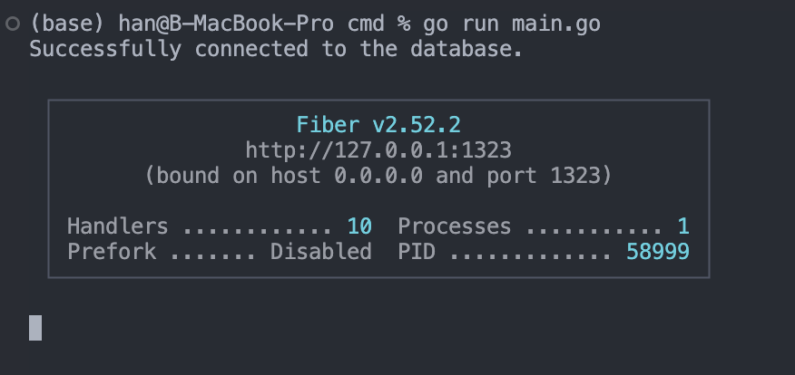
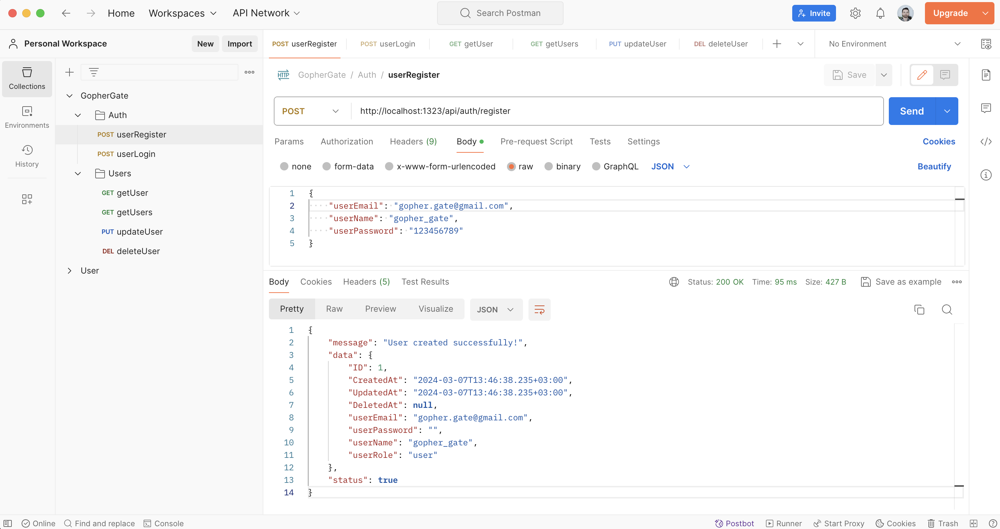
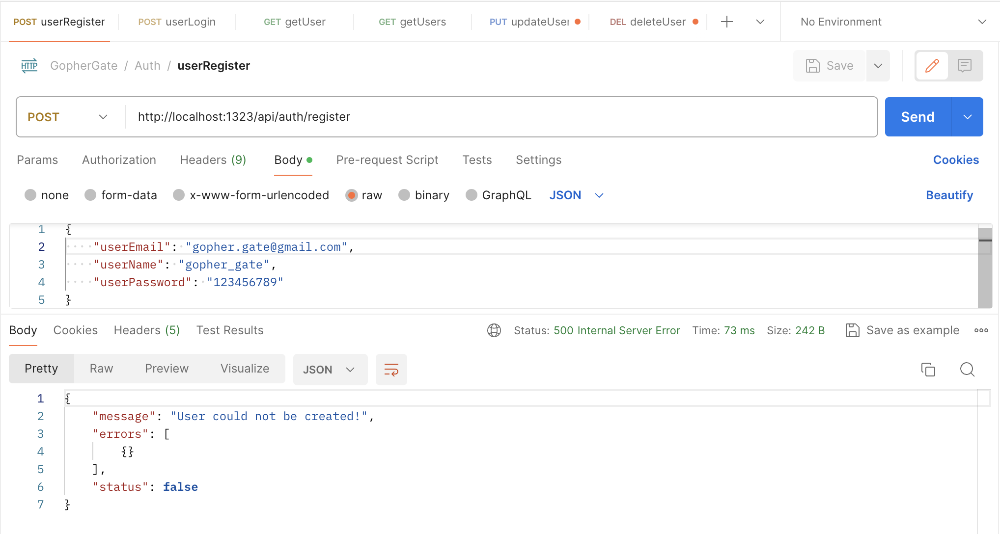

<br/>
<p align="center">
  <a href="https://github.com/ebekirbayar/GopherGate-Go-RESTful-API-with-JWT-and-MySQL">
    
  </a>

  <h3 align="center">GopherGate: Go RESTful API with JWT and MySQL</h3>

  <p align="center">
    This project, named GopherGate, is a powerful RESTful API built using the Go programming language. It seamlessly integrates with MySQL, offering robust database capabilities for your application.
    <br/>
    <br/>
    <a href="https://github.com/ebekirbayar/GopherGate-Go-RESTful-API-with-JWT-and-MySQL">View Demo</a>
    .
    <a href="https://github.com/ebekirbayar/GopherGate-Go-RESTful-API-with-JWT-and-MySQL/issues">Report Bug</a>
    .
    <a href="https://github.com/ebekirbayar/GopherGate-Go-RESTful-API-with-JWT-and-MySQL/issues">Request Feature</a>
  </p>
</p>

   

## About The Project

## Features

- **User Creation**: Allows the creation of new users with unique email addresses.
- **User Authentication**: Provides user authentication using email and password.
- **User Retrieval**: Supports retrieving all users based on their roles, and fetching individual users by their IDs.
- **User Update**: Enables updating user information, restricted to administrator users.
- **User Deletion**: Allows deletion of users, restricted to administrator users.

## Installation

To install and run the GopherGate User Management API, follow these steps:

1. Clone the repository:

```bash
git clone https://github.com/ebekirbayar/GopherGate-Go-RESTful-API-with-JWT-and-MySQL.git
```

```bash
cd GopherGate-Go-RESTful-API-with-JWT-and-MySQL
```

```bash
go mod tidy
```

```bash
go run main.go
```
## Usage
### Endpoints
- POST /api/auth/register: Create a new user.
- POST /api/auth/login: Authenticate a user.
- GET /api/users: Retrieve all users based on user roles.
- GET /api/users/me: Retrieve a specific user by ID.
- PUT /api/users/{id}: Update user information.
- DELETE /api/users/{id}: Delete a user.
## Request Examples

POST /api/auth/register

```JS

Content-Type: application/json

{
    "userEmail": "gopher.gate@gmail.com",
    "userName": "gopher_gate",
    "userPassword": "123456789"
}

```

POST /api/auth/login

```JS
Content-Type: application/json

{
    "userEmail": "gopher.gate@gmail.com",
    "userPassword": "123456789"
}

```

GET /api/users

```JS
Authorization: Bearer your_jwt_token

```

<p align="center">
    
</p>
<p align="center">
    
</p>
<p align="center">
    
</p>
<p align="center">
    
</p>
<p align="center">
    
</p>
<p align="center">
    
</p>
<p align="center">
    
</p>
<p align="center">
    
</p>
<p align="center">
    
</p>
<p align="center">
    
</p>
<p align="center">
    
</p>
<p align="center">
    
</p>
<p align="center">
    
</p>
<p align="center">
    
</p>
<p align="center">
    
</p>
<p align="center">
    
</p>


## Contributing

Contributions are what make the open source community such an amazing place to be learn, inspire, and create. Any contributions you make are **greatly appreciated**.
* If you have suggestions for adding or removing projects, feel free to [open an issue](https://github.com/ebekirbayar/GopherGate-Go-RESTful-API-with-JWT-and-MySQL/issues/new) to discuss it, or directly create a pull request after you edit the *README.md* file with necessary changes.
* Please make sure you check your spelling and grammar.
* Create individual PR for each suggestion.
* Please also read through the [Code Of Conduct](https://github.com/ebekirbayar/GopherGate-Go-RESTful-API-with-JWT-and-MySQL/blob/main/CODE_OF_CONDUCT.md) before posting your first idea as well.

### Creating A Pull Request

##### Contributing to GopherGate: Go RESTful API with JWT and MySQL

* Thank you for considering contributing to GopherGate: Go RESTful API with JWT and MySQL! Follow the steps below to contribute:

1. Fork the Project: Click the "Fork" button in the top-right corner of the GitHub repository page to create a copy of the project in your GitHub account.

2. Create your Feature Branch: Open a terminal or command prompt and navigate to the directory where you want to clone the repository. Then, run the following command to create a new feature branch:

```sh
git checkout -b feature/YourAmazingFeature
```

Replace "YourAmazingFeature" with a descriptive name for your feature or the issue you're addressing.

3. Commit your Changes: Make your desired changes to the project files. After making changes, stage them for commit using the following command:

```sh
git add .
```
Then, commit your changes with a descriptive message:

```sh
git commit -m 'Add some AmazingFeature'
```
Replace "Add some AmazingFeature" with a brief description of the changes you've made.

4. Push to the Branch: Once your changes are committed, push your changes to your forked repository on GitHub:

```sh
git push origin feature/YourAmazingFeature
```

This will push your feature branch to your forked repository.

5. Open a Pull Request: Go to the GopherGate: Go RESTful API with JWT and MySQL repository on GitHub and switch to the branch you just pushed. Click the "New Pull Request" button to open a new pull request. Provide a descriptive title and detailed description of your changes in the pull request.

That's it! Your pull request will be reviewed by the project maintainers, and any necessary feedback or changes will be discussed there.

Thank you for contributing to GopherGate: Go RESTful API with JWT and MySQL!

## License

Distributed under the MIT License. See [LICENSE](https://github.com/ebekirbayar/GopherGate-Go-RESTful-API-with-JWT-and-MySQL/blob/main/LICENSE) for more information.

## Authors

* **Ebubekir BAYAR** - *Computer Engineer* - [Ebubekir BAYAR](https://github.com/ebekirbayar/)

